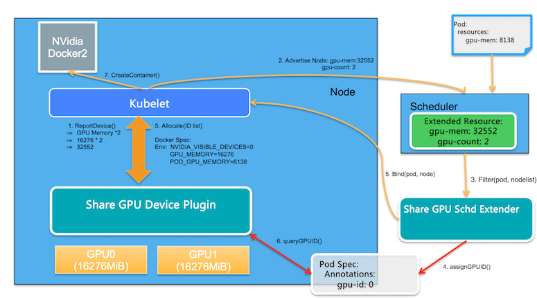
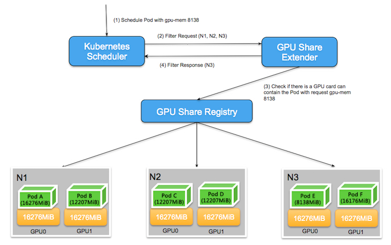
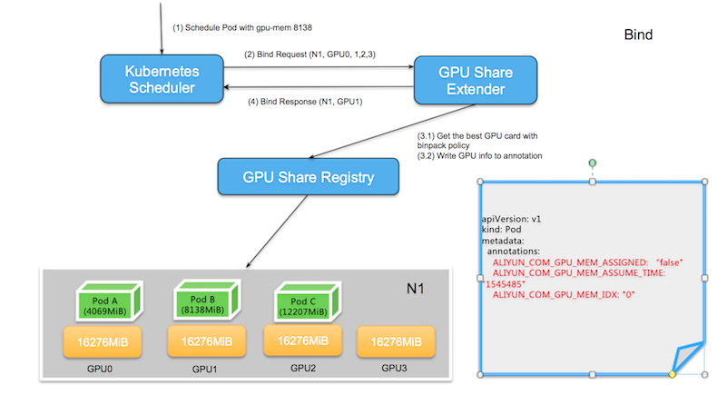
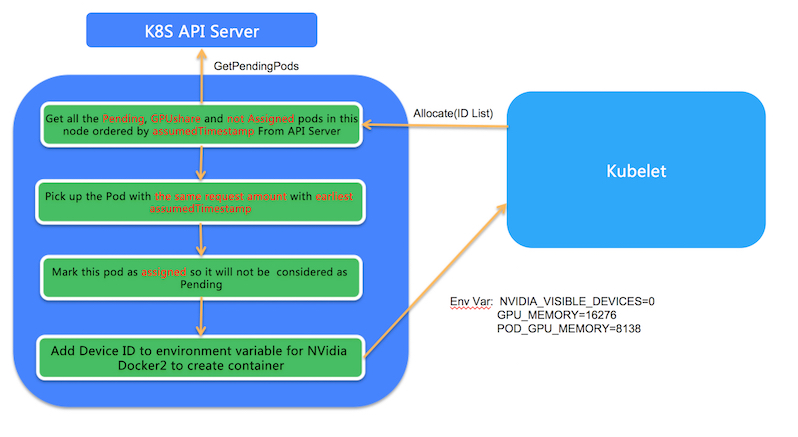

# GPU Sharing in Kubernetes

## Background

The Kubernetes infrastructure enforces exclusive GPU usage, preventing sharing GPUs across pods. This is not good for the users who want to use the sharing capabilities of NVIDIA GPUs to increase GPU utilization in a cluster. 
This can achieve better isolation, ensuring that the GPU usage of applications are not affected by other applications; it is very suitable for deep learning model training scenarios, but it is usually wasteful if the scenarios are the model development and model inference. Usually talking about supporting shared GPUs at the cluster level is usually two things: 

1. Isolation: Isolation is the basic of sharing a device, such as the fault isolation, memory isolation, real parallelism of the the shares of
the resource in each container at runtime level. It's inherently defined by the hardware device and the software controlling that device in the node, such as MPS(Mutiple Processing Service). In fact, it's Kubenetes helps a little in this.

2. Scheduling: Kubernetes should help the user to express the device sharing, and follow the user's specification to guarantee that devices can not be oversubscribed at the scheduling level but cannot in any measure enforce that at the runtime level.

For fine-grained GPU device scheduling, there is currently no good solution. This is because the extended resources such as GPU, RDMA in the Kubernetes  restricts quantities of extended resources to whole numbers, cannot support the allocation of complex resources. For example, It's impossible for the users who want to ask for the 0.5 GPU in the Kubernetes cluster. The essential problem here is that multi-device GPU sharing is a vector resource problem, while extended resources are descriptions of scalar resources.

## User Story

- As a cluster administrator, I want to increase the GPU usage of the cluster; during the development process, multiple users share the model development environment in the same GPU.
- As an application operator, I want to be able to run multiple inference tasks on the same GPU at the same time.

## Goals

- Make users can express requesting a share of a resource, and can guarantee that the GPU can not be oversubscribed at the scheduling level

## Non Goals

- Isolation of this shared resource
- Oversubscription

## Design Principles

- Although there are two Dimensions to describe the GPU (CUDA cores and GPU Memory), in the inference scenarios, we can make the assumption that the number of CUDA cores and GPU Memory are proportional. 

- Leverage Extended Resources to express requesting a share of the devices, but the minimum unit of measure dimension is changed from 1 GPU device to MiB for GPU memory. If the GPU used by the node is a single device 16GiB memory, its corresponding resource is 16276MiB.

- Since the user's appeal for the shared GPU is for the model development and prediction scenario. in these scenarios, the upper limit of the GPU resource requested by the user does not exceed one GPU, that is, the resource limit of the application is a single GPU.

- Not change any Kubernetes bare bone code, just leverage extended resource, scheduler extender and device plugin machasim. 

## Design

Define two new Extended Resources: the first is gpu-mem, which corresponds to GPU memory; the second is gpu-count, which corresponds to the number of GPU devices.

Below is the architecture:

### Core components

- **GPU Share Scheduler Extender**: It uses the Kubernetes scheduler extender mechanism, and be responsible for determining whether a single GPU device on the node can provide enough GPU Memory when the global scheduler Filter and Bind, and records the GPU allocation result to the Pod Spec Annotation for subsequent filter at the time of Bind. 

- **GPU Share Device Plugin**: It uses the Device Plugin mechanism, be responsible for the allocation of the GPU device according to the decision of the GPU Share Scheduler Extender recorded on the Pod Spec Annotation.

### Process

#### 1\. Device Resource Report

The GPU Share Device Plugin uses the nvml library to query the number of GPU devices and the GPU memory of devices. The total GPU memory (quantity * memory) of the node is reported to the Kubelet by `ListAndWatch()`; and Kubelet reports these to the Kubernetes API Server.

If the node has 2 GPUs, and each GPU has 16276MiB, the GPU Memory of the node is 16276 * 2 = 32552. And the number of GPU devices on the node is also reported as another Extended Resource. 

#### 2\. Schedule

The GPU Share Scheduler Extender records the allocation information into the annotation of, and determine whether each GPU has enough gpu-mem according to this information when the scheduler doing the filter.

2.1. After the Kubernetes scheduler finishes all the default filters, it will call the filter method of the GPU Share Scheduler Extender through http. This is because the default scheduler calculates the extended resource and can only determine whether the total amount of resources has free resources that meet the demand. Specifically determine whether the demand is met on a single device; therefore, it is necessary to check whether a single device has available resources by the GPU Share Scheduler Extender.

The following figure shows an example. There are 3 nodes with 2 GPU devices in a Kubernetes cluster, when the user applies for `gpu-mem=8138`, the default scheduler scans all nodes and finds that the remaining resources of N1 are (16276 * 2 - 16276 -12207 = 4069) and the resource requirements are not met, and the N1 node is filtered out. 

The remaining resources of the N2 and N3 nodes are 8138MiB. They all meet the requirements of the default scheduler. at this time, the default scheduler will delegate the GPU Share Scheduler Extender to do secondary filtering.

During the secondary filtering, the GPU Share Scheduler Extender needs to determine whether the single GPU devices meets the resource requirements. When checking the N2 node, it is found that although the node has 8138MiB available resources, but falls on each device, GPU0 and GPU1 have only 4069MiB of available resources. It can't meet the appeal of single device 8138MiB.

Although the N3 node has a total of 8138MiB available resources, these available resources belong to GPU0, which satisfies the single device requirements. Thus, accurate scheduling can be achieved by filtering the GPU Share Scheduler Extender.

2.2. When the scheduler finds a node that satisfies the requirements, it will delegate the GPU Share Scheduler Extender to bind the node and the pod. Here, the extender needs to do two things:

- Find the GPU device in the node according to the binpack rule, and record GPU device id and save it as `ALIYUN_GPU_ID` to the annotation of the pod.It also saves the GPU Memory of the pod application as `ALIYUN_COM_GPU_MEM_POD` and `ALIYUN_COM_GPU_MEM_ASSUME_TIME` in the annotation of the pod. If no GPU is found at the binding time, no binding is performed at this time. The default scheduler will reschedule after the expired timeout.

> Notice: There is also a Pod annotation named `ALIYUN_COM_GPU_MEM_ASSIGNED` which is initialized as `false`. It indicates that the pod is assumed with the GPU device in the schedule period, but not assigned at the runtime.

- Bind pod and node with Kubernetes API

For example, when the user wants to request the Pod with gpu-mem:8138. And the node  N1 is selected, the available resources of different GPUs will be compared first, namely GPU0 (12207), GPU1 (8138), GPU2 (4069). GPU3 (16276), in which the remaining resources of GPU2 (4069) are not satisfied, and disdeviceed; and in the other three GPUs that satisfy the requirements, GPU1 (8138), which has the least remaining resources, is selected.

#### 3\. Run the deployment on the node

An `Allocate` function in GPU Share Device Plugin which is called from Kubelet before creating the container, and the paramter of `Allocate` is the GPU memory request amount: 

3.1 Get all the Pending and GPU Share pods with the GPU memory request amount in this node ordered by assumedTimestamp From Kubernetes API Server

3.2 Choose the Pod with the GPU memory request amount specified in the parameter of the `Allocate` fuction. There may be some pods with the same GPU memory request amount. If so,  it chooses the Pod with the earliest assumedTimestamp.

3.3 And it marks the chosen pod's annotation `ALIYUN_COM_GPU_MEM_ASSIGNED` as `true`, and it indicates the GPU device is assigned to the container in the runtime.

 

